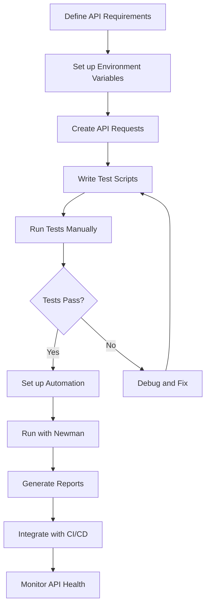
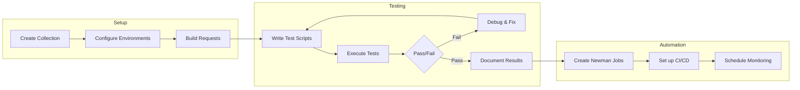
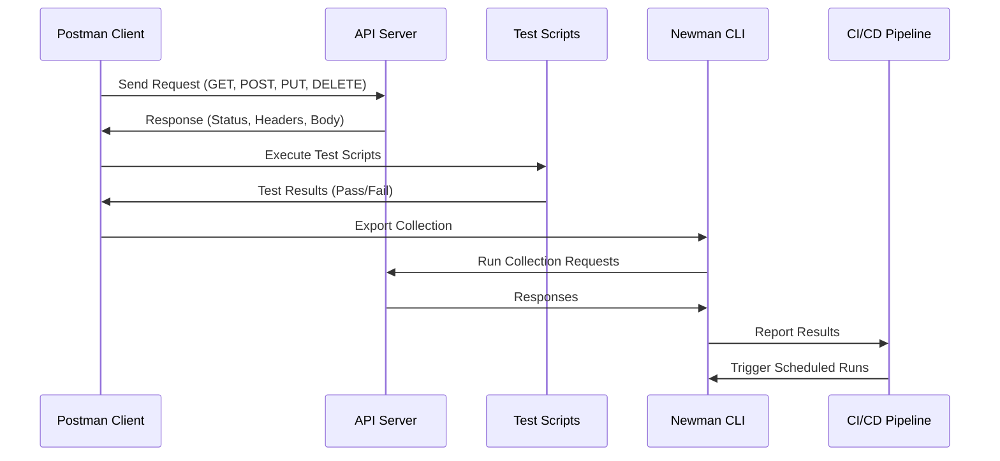

# Postman API Testing

A collection of Postman examples and resources for effective API testing.

## Overview

This repository contains Postman collections and resources to help you learn and implement API testing using Postman. It's designed for developers and QA professionals who want to improve their API testing skills and automate their testing workflows.

## API Testing Workflow



## Contents

- **exam.postman_collection.json**: A sample Postman collection that demonstrates API testing concepts and techniques.

## Getting Started

### Prerequisites

- [Postman](https://www.postman.com/downloads/) installed on your system
- Basic understanding of API concepts

### Installation

1. Clone this repository:
```bash
git clone https://github.com/ajeetraina/Postman-API-Testing.git
```

2. Import the collection into Postman:
   - Open Postman
   - Click on "Collections" in the left sidebar
   - Click the "Import" button
   - Select the `exam.postman_collection.json` file

## Features

- **API Request Examples**: Sample API requests demonstrating various HTTP methods (GET, POST, PUT, DELETE)
- **Test Scripts**: JavaScript test examples to validate API responses
- **Environment Variables**: Examples of using variables for flexible testing

## Key Concepts

### Collections

Collections in Postman are folders that help you organize related API requests. They allow you to:
- Group related requests together
- Run multiple requests sequentially
- Share API workflows with team members

### Environment Variables

Environment variables help you manage different testing environments (development, staging, production). Benefits include:
- Reusing requests across environments
- Securing sensitive data
- Simplifying environment switching

### Test Scripts

Postman allows you to write JavaScript tests that run after a request is sent. You can:
- Validate status codes and response formats
- Check specific data in responses
- Chain requests together
- Automate testing workflows

## API Testing Process Visualization



## Automation with Newman

To run collections via command line:

1. Install Newman (Postman's command-line runner):
```bash
npm install -g newman
```

2. Run a collection:
```bash
newman run exam.postman_collection.json
```

3. Generate HTML reports:
```bash
newman run exam.postman_collection.json -r html
```

## Best Practices

- Organize requests in logically structured collections
- Use environment variables for different testing environments
- Write comprehensive test scripts to validate responses
- Document your API requests and expected responses
- Integrate with CI/CD pipelines for continuous testing

## API Request Lifecycle



## Further Resources

- [Postman Learning Center](https://learning.postman.com/docs/getting-started/introduction/)
- [API Testing Basics](https://www.postman.com/api-platform/api-testing/)
- [Writing Test Scripts](https://learning.postman.com/docs/tests-and-scripts/write-scripts/test-scripts/)
- [Newman Documentation](https://learning.postman.com/docs/running-collections/using-newman-cli/command-line-integration-with-newman/)

## Contributing

Contributions are welcome! Please feel free to submit a Pull Request.

## License

This project is licensed under the MIT License - see the LICENSE file for details.
